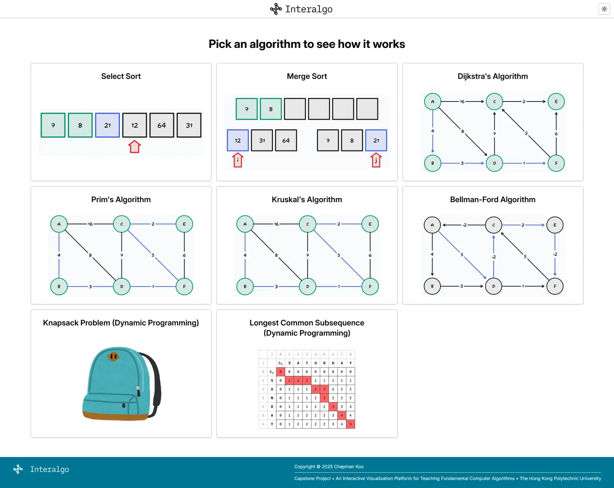
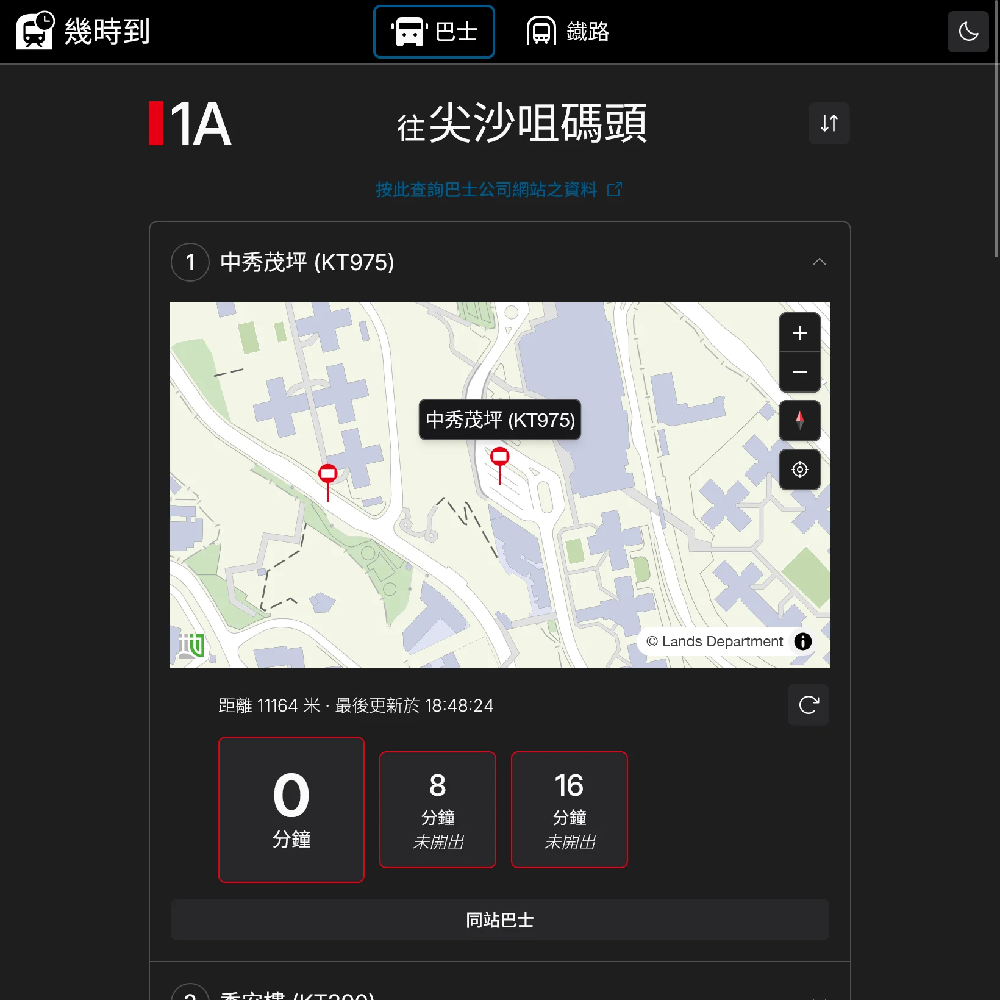

# Hi! I'm Chapman

I am a Computer Science graduate from The Hong Kong Polytechnic University.

I build web and mobile applications with TypeScript, React, Next.js, and Expo.

## Projects

### Interalgo

This is my Capstone Project at PolyU. 

An interactive web application that visualizes fundamental algorithms from the COMP3011 course and lets students explore how they work step by step.

It covers Selection Sort, Merge Sort, Dijkstra’s, Prim’s, Kruskal’s, Bellman-Ford, Knapsack, and Longest Common Subsequence.

Users can select an algorithm, provide inputs, and follow its execution visually.

Built using Astro, React, tldraw, and shadcn/ui components.

[Try it at https://interalgo.chapman-2cb.workers.dev/](https://interalgo.chapman-2cb.workers.dev/)

### Check ETA

This is yet another app to check real-time bus and MTR arrival times.

Features include route search, real-time arrival information, map-based stop discovery, and responsive mobile layouts.

Originally built in 2024 and rebuilt in 2026 with a modern React stack.

Built using React, TanStack Router, shadcn/ui, MapCN, and Lands Department Vector Map.

[GitHub Repository](https://github.com/chapmankoo28/check-eta)

[Try it at https://check-eta.chapman-2cb.workers.dev/](https://check-eta.chapman-2cb.workers.dev/)

